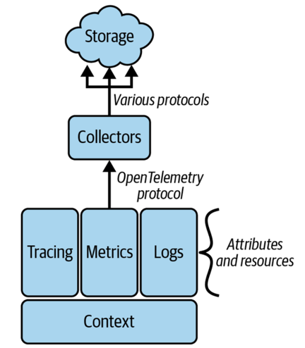
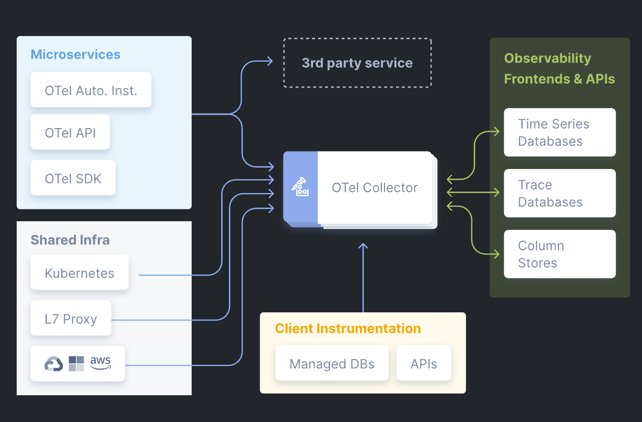
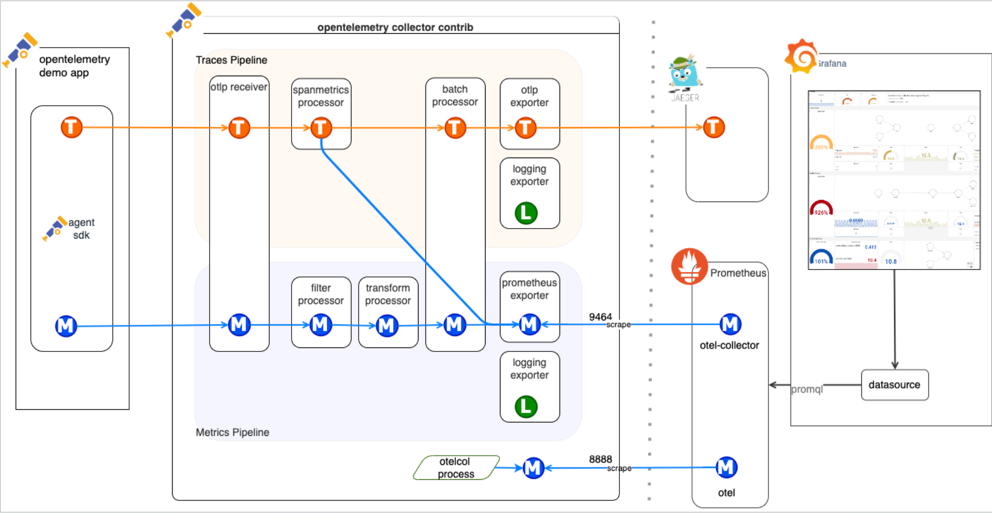
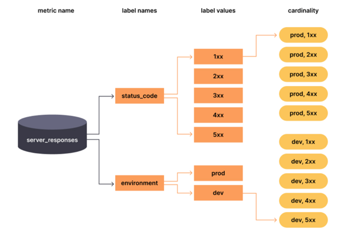

# Open telemetry

OpenTelemetry is a set of APIs, libraries, agents, and instrumentation to provide observability for applications. It is a vendor-neutral standard for collecting telemetry data (metrics, logs, and traces) from applications. 

OpenTelemetry is a project under the Cloud Native Computing Foundation (CNCF) and is designed to work with various observability backends.

**Telemetry** is the data collected from applications, including metrics, logs, and traces. The data that describes what your system is doing. Let's separate then in two groups:

- **User telemetry:** User telemetry is the data collected from users, including user interactions, events, and errors. *(Clicks, hovers, session duration ...)*
- **Performance telemetry:** Performance telemetry is the data collected from applications to measure performance, including response times, error rates, and throughput. *(Latency, errors, availability ...)* In this contexts we use breadcrumbs to understand cause and effect when we have different sources at play.

###  Signals

Signals are the different types of telemetry data that can be collected. Event logs, system metrics and continuous profiling are examples of signals.
Every signal consist of different parts:
- **instrumentation:** the code that emits the telemetry data.
- **transmission system:** the part that sends the data over the network, it may include formating the data too.
- **analysis tool:** the tool that receives and analyzes the telemetry data. Where the observation occurs.

It's common to conflate telemetry with analysis, they are separate from each other. Both of things are needed to have a complete observability solution.

We will call the three pillars of observability: *logs, metrics and traces* signals. Open telemetry supports these three and brings this information together to find important connections.

### Concepts to understand:

On a high level, this is a basic model of open telemetry: 

- **Resources:** A resource is a set of attributes that describe the entity producing telemetry data. For example, a resource could represent a virtual machine, a container, or a serverless function.
- **Context:** Context is a mechanism for propagating information across process boundaries. It allows spans to be correlated with the resources and transactions they belong to. Typically, we will talk about soft and hard context.
- **Soft context:** allows you to create unique dimensions across telemetry signals that help explain what a particular signal represents, eg: a user ID, a session ID, a trace ID, etc. This is the information that is not always present in a signal.
- **Hard context:** is the information that is always present in a signal. eg: a resource ID, a service name, a version, etc. This is the information that is always present in a signal.
- **Trace/Transaction:** Is a way to model work, a set of logs (spans) linked together by a hard context. Very useful to understand the flow of a request across multiple services.
- **Spans:** A span is a single operation within a transaction. Spans can be nested to represent the hierarchy of operations within a transaction. A typical span will have a start time, an end time, a name, and a set of attributes. Spans are the building blocks of traces.
- **Metrics:** Metrics are numerical values that represent the performance of a system. They can be used to measure the health of a system, such as response times, error rates, and throughput.
- **Propagators:** Propagators are used to propagate context across process boundaries. They are responsible for serializing and deserializing context information *(hard context)*. For example, HTTP headers can be used to propagate context information between services.

### Attributes

Attributes are key-value pairs that provide additional information about a span. They can be used to add metadata to spans, such as the name of the service, the version of the service, and the environment in which the service is running. 

Attributes are used to filter and group spans in observability tools.

Attributes are essential to bring context into a spam, but one needs to be careful about the amount of attributes that are added as they can increase the size of the telemetry data and make it harder to analyze, or create what's known as a *Cardinality explosion*. This is when the number of unique values for a given attribute increases exponentially, making it difficult to analyze the data in a time-series database.

Thousands of unique values for a given attribute can lead to performance issues and increased storage costs. This is because the database needs to store and index all the unique values, which can slow down queries and increase the amount of storage required.

A way how to avoid this cardinality growth is by avoiding attributes that can have many different values, and moving them those keys into spans or logs instead.

More about cardinality [here](https://grafana.com/blog/2022/02/15/what-are-cardinality-spikes-and-why-do-they-matter/).

The [OpenTelemetry Semantic Conventions](https://opentelemetry.io/docs/concepts/semantic-conventions/) are a set of guidelines for defining attributes and metrics in OpenTelemetry. They provide a consistent way to define attributes and metrics across different programming languages and frameworks. This helps to ensure that the telemetry data collected from different services is consistent and can be easily analyzed.

### Using open telemetry

We can use a *"white box"* approach to instrument our code. This means that we can add instrumentation directly into our code. This is the most common approach and is used by most libraries and frameworks.

On the other hand, a *back box* approach is used when we don't have access to the code or when we want to instrument a third-party library. This is done by using agents or sidecars that intercept the telemetry data and send it to the observability backend. This is the most common approach for cloud-native applications. 

Golden signals as defined by Google (SRE Handbook):
- **Latency:** The time it takes to process a request. This is the most important signal to monitor, as it directly affects the user experience.
- **Traffic:** The amount of requests being processed. This is a good indicator of the load on the system.
- **Errors:** The number of errors being generated (as a rate). This is a good indicator of the health of the system.
- **Saturation:** The amount of resources being used. This is a good indicator of the capacity of the system.
