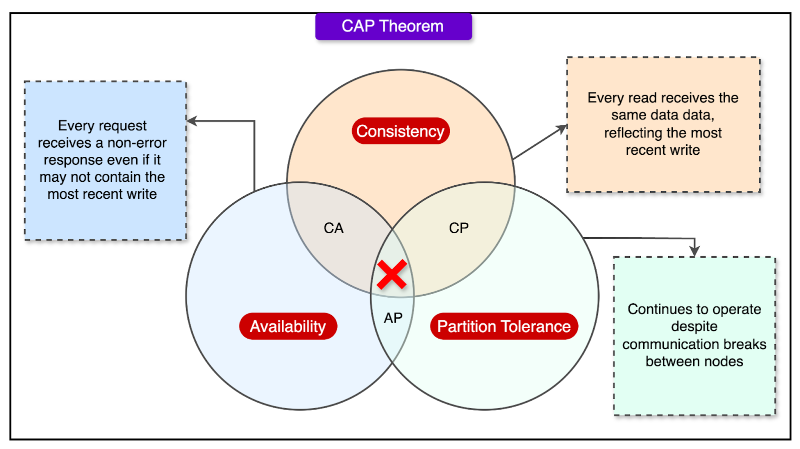
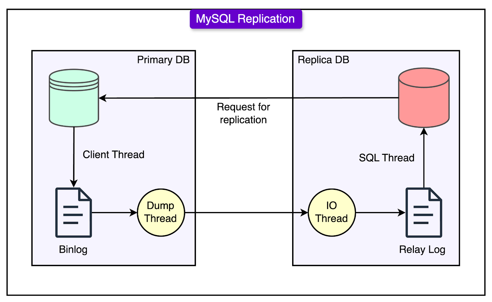
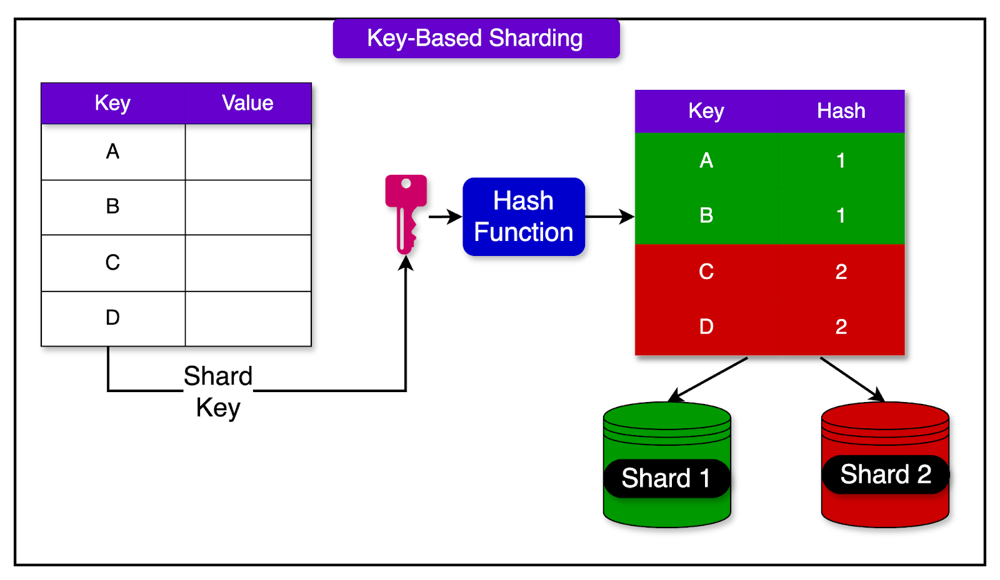

# Cap priciple

This principle states that in the event of a network issue, a system can only guarantee two of the following three properties: Consistency, Availability, and Partition Tolerance.

Partition tolerance is a must for distributed systems, so engineers are left choosing between consistency and availability. 

All large-scale platforms chose to make trade-offs, sacrificing strict consistency in some areas to maintain high availability.

This is done by classifying different types of read operations with a dual strategy:

- **Replica Reads:** Used when absolute freshness isn’t critical. For example, displaying a video or showing view counts doesn't require second-to-second accuracy. A few seconds of delay in updating the view count won’t harm user experience.

- **Primary Reads:** Reserved for operations that require up-to-date data. For example, after a user changes their account settings, they expect to see those changes reflected immediately. These read operations are directed to the primary, which has the most current data.

The underlying idea was that not all read requests are equal. Some data must be fresh, but a lot of content can tolerate a slight lag without negatively impacting the user experience.

As traffic surges, so does the number of write operations to the database: uploads, comments, likes, updates, and more. This increase in write queries per second (QPS) eventually made replication lag a serious problem.

MySQL’s replication process, especially in its traditional form, is single-threaded. This means that even if the primary database handles many write operations efficiently, the replicas fall behind because they process changes one at a time. When the volume of writes crosses a certain threshold, the replicas can’t keep up. They begin to lag, causing stale data issues and inconsistencies.

See the diagram below that shows the MySQL replication process.

To address this, YouTube engineers introduced a tool called **Prime Cache**.

> Prime Cache reads the relay log (a log of write operations that replicas use to stay in sync with the primary). It inspects the WHERE clauses of upcoming queries and proactively loads the relevant rows into memory (cache) before the replica needs them.

Here’s how it helps:

- Normally, a replica processes a write operation and must fetch data from a disk as needed.

- Prime Cache pre-loads the necessary data into memory, turning what was previously disk-bound work into memory-bound operations.

- As a result, the replication stream becomes faster because memory access is much quicker than disk access.

This optimization significantly improved replication throughput. Replicas were now able to stay more closely in sync with the primary, even under high write loads.

While Prime Cache wasn’t a permanent fix, it allowed YouTube to handle a much higher volume of writes before needing to implement more complex scaling strategies like sharding.

## Sharding and Vertical Splitting

As YouTube's backend continued to grow, even optimized replication couldn’t keep up with the sheer scale of the data. The size of the database itself became a bottleneck. It was too large to store efficiently on a single machine, and the load was too heavy for any one server to handle alone.

To address this, YouTube adopted two complementary strategies: vertical splitting and sharding.

## Vertical Splitting

Vertical splitting involves separating groups of related tables into different databases. 

For example, user profile data might be stored in one database, while video metadata is stored in another. This reduces the load on any single database and allows independent scaling of different components.

## Sharding

Sharding takes this a step further by dividing a single table’s data across multiple databases, based on some key, often a user ID or a data range. Each shard holds only a portion of the overall data, which means that write and read operations are spread across many machines instead of one.

Sharding comes with some trade-offs as well:

- Transactions that span multiple shards are difficult to coordinate, so strong guarantees like atomicity and consistency across shards are often sacrificed.

- Queries that need data from multiple shards or tables may no longer work as expected.

- The application must now know how to route queries to the correct shard and how to handle cross-shard queries when needed.

- For certain types of queries that span shards, special indexing and synchronization logic are required.

To cope with this complexity, YouTube's client logic evolved significantly. It was no longer enough to simply connect to a database and send queries. The client now needed to determine whether a read should go to a replica or the master, decide which shard a query should be routed to, based on the query’s WHERE clause, and maintain and update cross-shard indexes where needed.

This shift placed more responsibility on the application layer, but it also enabled YouTube to scale far beyond the limits of a single MySQL instance. (eg Vitess)