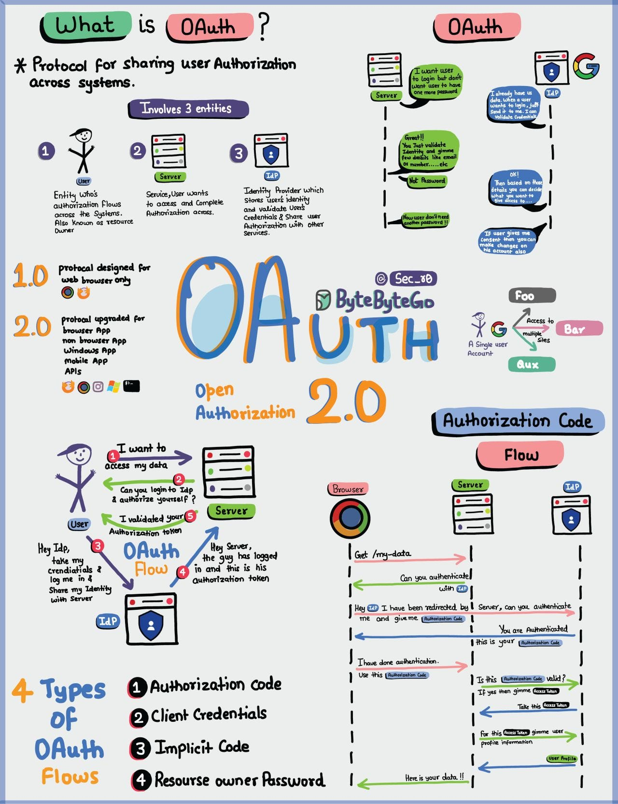

# OpenID Connect protocol

OpenID Connect is an interoperable authentication protocol based on the OAuth 2.0 framework of specifications (IETF RFC 6749 and 6750)

It simplifies the way to verify the identity of users based on the authentication performed by an Authorization Server and to obtain user profile information in an interoperable and REST-like manner.

